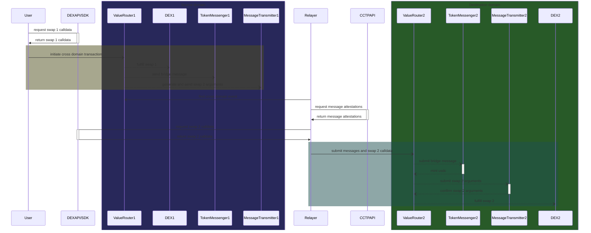
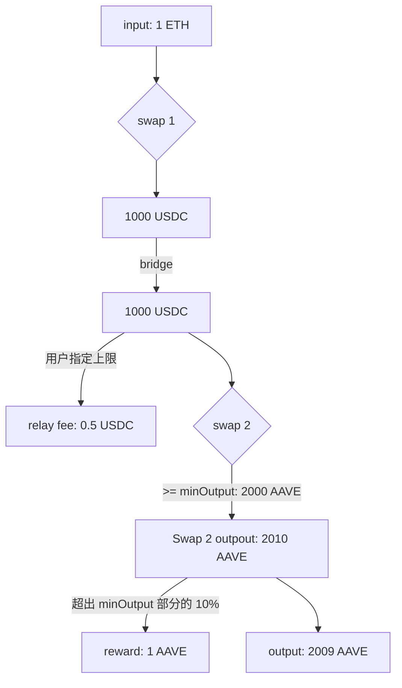

## 主流程

ValueRouter 跨链 swap 由两笔 tx 构成，tx1 由用户发起，tx2 由 relayer 发起.

Tx1 包含 swap 1，把 token input 兑换为 usdc.
Tx2 包含 swap 2，把 usdc 兑换为用户想要的 token output.

**1. 发起交易**

用户先估算出 swap 1 产生的 usdc 数量，然后估算 swap 2 产生的 token out 数量，然后构建 swap 1 calldata 和 swap 2 arguments.
Swap 2 arguments 包含最低 swap output，由于跨链间隔时间会产生价格变化，用户要选择适当低的 minOutput 值以保证成功率.

用户向 VR 合约传入 swap 1 call data 和 swap 2 arguments，VR 合约会执行 swap 1，然后通过 CCTP 发起两个绑定的跨链消息，第一个消息是 usdc 跨链，第二个消息是 swap 2 arguments。

**2. relay 交易**
   
Relayer 监听到 tx1 的 SwapAndBridge 事件后，从 CCTP API 获取对应的两个 messages 和 attestations。
然后 Relayer 要根据跨链 usdc 数量和 swap 2 arguments 的要求，构建 swap 2 calldata。然后发起 tx2，向目标链 VR 合约提交 messages attestations 以及 swap 2 calldata。

目标链 VR 合约会检查 messages 的合法性，执行 swap 2，检查 swap 2 的结果，向收款地址转发 swap output，结算 relayer 手续费。

### 退款流程
1. 用户读取 tx1 的 logs，找到两个 MessageSent events，可以与 SwapAndBridge event 中的 bridgeMessageHash 和 swapMessageHash 比对.
2. 用户从 CCTP API 获取 attestations
3. 等到 deadline 到期后在目标链发起 cancel 交易，传入 messages 和 attestations，用户会在目标链获得 USDC.

## 错误处理
- swap 1 失败 - tx1 revert
- swap 2 执行失败 - tx2 revert，等 deadline 过后执行退款
- swap 2 执行成功，输出不满足要求 - tx2 revert，等 deadline 过后执行退款
- deadline 之前 tx2 没有执行成功 - 任何人可以触发退款

## Relayer 激励
假设用户 swap 1 产出 1000 usdc，准备通过 swap 2 兑换到 2000 aave.
1. 用户在 swap 2 arguments 中指定 swap 2 最低换出 2000 aave，允许最多 1 usdc 作为 relayer fee，10% 的额外奖励 rate
2. relayer 确认跨链接收到 1000 usdc
3. relayer 根据自定的规则，决定使用 999.5 usdc 用作 swap 2 input，剩下 0.5 usdc 给自己
4. relayer 生成 swap 2 calldata
5. 合约检查 0.5 usdc <= 1 usdc
6. 合约执行 swap 2 calldata，产生 2010 aave
7. 合约检查 swap 2 output >= 2000 aave
8. 合约发现多出 10 aave，按照额外奖励 rate，relayer 分得 1 aave，9 aave 归用户
9. 合约检查是否还有剩余 usdc 未使用，必须全部使用掉

## 去中心化
- 利用 CCTP 保证跨链安全性，不需信任其他假设.
- Relayer 不能阻止用户进行跨链 swap.
- Relayer 不能故意使 swap 失败.
- Relay 交易会消耗掉所有的 usdc，没有残留.
- Relayer 可以根据用户愿意提供的手续费自行判断是否要处理 relay 任务，避免亏损.
- Relayer 与用户无法串通谋利.

## 问题
### Relayer MEV
Relayer 可以抢先提交不够优化的交易，以达到抢占手续费，或其他目的，例如操纵价格.
构建更简单的 swap 2 calldata，和矿池合作，都可以提高 relay 交易完成速度.
这会使用户和其他 relayer 利益受损. 最差情况是让用户收到 minOutput.
